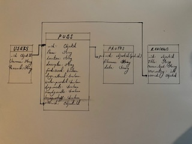

# Paws & Pints

**Developer: Amy Cook**

[Visit live website](https://paws-and-pints-9f68e52a491c.herokuapp.com/)

## Table of Content

- [Project Goals](#project-goals)
  - [User Goals](#user-goals)
  - [Site Owner Goals](#site-owner-goals)
- [User Experience](#user-experience)
  - [Target Audience](#target-audience)
  - [User Requirements and Expectations](#user-requirements-and-expectations)
- [User Stories](#user-stories)
  - [Site User](#site-user)
  - [Site Owner](#site-owner)
- [Structure](#structure)
  - [Site Structure](#site-structure)
  - [Database Structure](#database-structure)
- [Design](#design)
  - [Colour Scheme](#colour-scheme)
  - [Fonts](#fonts)
  - [Wireframes](#wireframes)
- [Technologies Used](#technologies-used)
  - [Languages](#languages)
  - [Frameworks, Libraries & Tools](#frameworks-libraries--tools)
- [Features](#features)
- [Future Implementations](#future-implementations)
- [Deployment](#deployment)
- [Testing](#testing)
- [Credits](#credits)
- [Acknowledgements](#acknowledgements)

## Project Goals

- Develop a website dedicated to helping dog owners find and review dog-friendly pubs on the beautiful Island of Anglesey. Users can share their experiences, ratings, and recommendations, creating a comprehensive database of pet-friendly establishments. This community-driven platform enables users to make informed choices about where to take their furry companions. Additionally, the site owner can leverage the growing dataset to attract more users and support local businesses in the hospitality industry 

### User Goals
- Discover Dog-Friendly Pubs: Users can easily find pubs that welcome dogs, enabling them to plan outings with their pets more conveniently.
- Share Experiences: Users can contribute their own reviews and ratings of dog-friendly pubs, helping fellow dog owners make informed decisions about where to visit.
- Community Engagement: The platform fosters a sense of community among dog owners, allowing them to connect with others who share similar interests and experiences.
- Contribute to a Growing Resource: By sharing their experiences, users contribute to a comprehensive database of dog-friendly pubs, benefiting both themselves and the wider community of dog owners.
- Support Local Businesses: Users can support local pubs that cater to dog owners by promoting and patronizing these establishments, thereby contributing to the local economy.

### Site Owner Goals

- Develop an entertaining and engaging platform that allows users to contribute to a growing database of dog-friendly pubs by submitting reviews, ratings, and photos, enriching the platform for the benefit of all users. 
- Implement simple and intutive navigation throughout the website.
- Craft a visually appealing design for enhanced user experience.
- Ensure a fully responsive and accessible website.
- A custom 404 page that redirects the user to the home screen. 

## User Experience

### Target Audience

- Dog Owners: Individuals who own dogs and are interested in finding pubs and establishments where they can enjoy outings with their pets.
- Local Residents of Anglesey: who are looking for nearby pubs that welcome dogs, either for regular outings or when hosting visitors.
- Tourists: Anglesey attracts many tourists who visit with their k9 companions, these tourists will want to explore the many beutiful walks we have here on the Island and most probably appreciate a post hike pint at a nearby dog friendly pub.
- Pub Owners: Owners and managers of pubs and hospitality establishments that cater to dog owners and want to promote their venues to a wider audience.

### User Requirements and Expectations

- Easy Search and Discovery: Users expect to easily search for dog-friendly pubs based on locations
- The review submission process should be simple and intuitive for users, allowing them to easily share their experiences with dog-friendly pubs. Clear instructions and prompts should guide users through each step, ensuring a seamless and hassle-free process.
- Mobile-Friendly Experience: Users anticipate a mobile-friendly experience that allows them to access the website on their smartphones and tablets while on the go, ensuring convenience and flexibility.
- User-Generated Content: Users expect the website to feature user-generated content such as reviews, ratings, and photos, allowing them to benefit from the experiences of other dog owners.
- Visual Appeal: Users appreciate a visually appealing website design that showcases high-quality images of dog-friendly pubs and creates a pleasant browsing experience
- Accessibility: The website should be accessible to all users, including those with disabilities, by adhering to accessibility standards. This ensures usability and navigability for everyone, regardless of their abilities.

## User Stories

### Site User

1. Discover dog-friendly pubs across Anglesey and explore their amenities and services.
2. Engage with authentic reviews from fellow users to make informed decisions about pub visits.
3. Contribute to the community by adding new dog-friendly pubs and sharing personal experiences through reviews. 
4. The ability to edit their review entries to reflect updated experiences or feedback.
5. The ability to add pubs to the site and uploaded a photo to accompany the pub details. 
6. The ability for the user to delete pubs and reviews that they themselves have added. 

### Site Owner

7. Manage pub entries and reviews seamlessly with options to edit or delete content effortlessly.
8. Create an immersive and user-friendly platform with intuitive navigation, captivating visuals, and an appealing design.
9. Ensure a seamless user experience across all devices by implementing full responsiveness, allowing the website to adapt seamlessly to different screen sizes and device types.
10. The user to be directed to a custom 404 error page upon entering a non-existent URL.

## Structure

### Site Structure 

- The site's navigation bar provides access to all main sections, along with additional links for adding or editing content, which are available to logged-in users.

| **Navbar?** | **Logged Out** | **Logged In (non-admin)** | **Logged In (admin)** |
| ----------- | -------------- | ------------------------- | --------------------- |
| Yes         | Home           | Home                      | Home                  |
| Yes         | ---            | Profile                   | Profile               |
| Yes         | ---            | Add Pub                   | Add Pub               |
| Yes         | ---            | ---                       | Manage Reviews        |
| Yes         | Log In         | ---                       | ---                   |
| Yes         | Register       | ---                       | ---                   |
| Yes         | ---            | Log Out                   | Log Out               |

Logged Out Navbar

Logged In Navbar

Admin Navbar

#### Database Structure

For this dog-friendly pub review site, I've opted to use MongoDB for its non-relational database capabilities. This choice supports dynamic inputs across collections, facilitating diverse data storage such as user reviews, pub details, and photos.

## Design

### Colour Scheme

- Consistency was maintained in the color scheme across all screens, with the primary background color being #e8f5e9. This choice was made as the light green color gives excellent readability for black text and gives a calm, fresh appearance to the site. The dark blue of the nav bar, #1e3a5f, compliments this background color well and looks quite stark against it. The most important element in considering the design of this site is that it is simple, clear and straightfoward to navigate. 

### Fonts

- Google Fonts were  integrated into the website, with Lora as the primary font, accompanied by a sans-serif fallback for optimal readability across all screens. To inject a stylish but playful touch, Pacifico was selected for the headings, this font pairs nicely with Lato. 

### Wireframes

HOME

LOGIN 

REGISTER

PROFILE

ADD PUB

MANAGE REVIEWS (admin page)

## Technologies Used

### Languages

- HTML
- CSS
- JavaScript
- Python

### Frameworks, Libraries & Tools

- [Flask](https://pypi.org/project/Flask/) - Micro framework for site templating.
- [Materialize v1.0.0](https://materializecss.com) - The framework for the website.
- [Git](https://git-scm.com/)
- [GitHub](https://github.com/) was used as a remote repository to store project code and host the webpage 
- [Chrome dev tools](https://developers.google.com/web/tools/chrome-devtools)
- [Am I Responsive](http://ami.responsivedesign.is/)
- [Adobe Stock Images]
- [Font Awesome](https://fontawesome.com/)
- [Google Fonts](https://fonts.google.com/)
- [WC3 Validator](https://validator.w3.org/), [Jigsaw W3 Validator](https://jigsaw.w3.org/css-validator/), [JShint](https://jshint.com/), [Wave Validator](https://wave.webaim.org/), [Lighthouse](https://developers.google.com/web/tools/lighthouse/) and [Am I Responsive](http://ami.responsivedesign.is/) were all used to validate the website
- [Jinja](https://jinja.palletsprojects.com/en/3.1.x/) - Templating engine.
- [Heroku](https://www.heroku.com) - For website deployment.
- [MongoDB](https://www.mongodb.com) - The database used for storing information for the site.
- [Pip](https://pypi.org/project/pip/) - To install Python packages.
- Jquery

## Features

### NavBar 

The top navigation bar includes the site name and adapts its links based on the user's login status. On smaller screens, the navbar collapses into a sidebar.

For non-logged-in users, links to the home, sign-in, and register pages are available. Once logged in, users gain access to their personal profile, the option to add new pubs, and the ability to write reviews.

Nav sidebar

### Home screen

- Title: Dog Friendly Pubs in Anglesey - provides context for the directory and lets the user know immediately if the content is for them or not. 
 - displays all the Pubs listed in the directory using cards that display a photo of the pub, pub name, pub location and the average rating of the pub. Clicking on the reveal button displays a description of the pub alongside all the pub reviews. Users are here invited to leave their own reviews. 
- icons at the very bottom of the card lets users know whether the pub serves food, whether dogs are allowed inside, is water provided for dogs, are meals offered for dogs, is there beautiful walks nearby and, finally, whether the staff were friendly. These aspects were focused on as research revealed that these are the most important consideration for those that like to include their dogs on adventures. 
- Visual feedback on the pub's rating is provided through an average rating, represented by colored stars corresponding to the average rating

See feature

See feature

### login Page

- Short explaination for user that instructs them of the need to log in to be able to leave a review or add a pub. 
- hyper link that user can click and be redirected to if they dont already have an account and need to register.
- username and password input boxes. 
- show password clickbox that can be toggled to reveal the inputted password.
- flash message to let user know that login has been sucessful.

See feature

### Registration page
     
- Redirection if user needs to simply login with link that can be clicked and redirected appropiately.
- Username and password input boxes.  
- show password clickbox that can be toggled to reveal the inputted password.
- flash message that appears to let user know that registration has been successful

See feature

### Profile Page   

- brief flash message saying welcome back.
- Displays the users reviews with edit and delete buttons allowing for changes and permanent deletion if necessary.
- Displays the pubs added by the user with edit and delete buttons allowing for changes and permanent deletion if necessary 

See feature

### Manage Reviews page    

- This is only accessible to the administrator.
- Displays all users reviews with delete buttons allowing for permanent deletion if necessary.
- Displays all users pubs with delete buttons allowing for permanent deletion if necessary. 

See feature

### 404 error page

- A 404 error page is presented when users enter a non-existent URL.

See feature

## Defensive Programming

Defensive programming is implemented in order to ensure secure access control. Conditional checks verify user permissions, ensuring only admins can edit any user's posts or access admin areas. For regular users, they can only edit their own posts. Unauthorized users are redirected to the login page.

Specifically, the profile route includes several security measures:

Session Check: If session["user"] is not set, the user is redirected to the login page.
Session Username Validation: The session username is retrieved from the database to confirm it matches the current session’s username.

URL Username Match: It ensures the session username matches the username in the URL. If they don’t match, access is denied, a flash message reads 'You need to be logged in to view this page' and the user is redirected to the login page.

These checks prevent unauthorized access and ensure that users can only access their own profiles.

Returns User to login page

## Future Implementations

- Enabling users to upload their own images and store them in MongoDB was a challenging task. This function requires more defensive programming to ensure robustness, and further research is needed to evaluate the scalability of storing images in this manner, as it may become problematic in the future. Additionally, when a pub is deleted from the database, the corresponding image is not being removed. If I had more time, addressing this issue would be a priority, as it contributes to unnecessary storage strain. One potential solution is to incorporate a function into the photo upload route that reduces image size, which could help conserve storage space.

- A sort-by function that arranges pubs by highest average reviews would be beneficial as the site grows in the number of pubs and reviews. This feature would enhance user experience by allowing visitors to easily find the most highly-rated pubs.

- The search bar is functional but lacks polish; search results do not appear at the top of the page but remain in their original positions, creating a disorganized appearance. Despite various attempts to fix this issue, it remains unresolved. Addressing this problem will be crucial as the number of pub entries increases, as users currently need to scroll past empty space to find their search results. This area definitely needs improvement in the future.

## Deployment & Local Development

### MongoDB Non-Relational Database

This project uses [MongoDB](https://www.mongodb.com) for the Non-Relational Database.

To obtain your own MongoDB Database URI, sign-up on their site, then follow these steps:

- The name of the database on MongoDB should be called "__pub_reviews__".
- The collection(s) needed for this database should be "__photos__", "__pubs__",__users__ and "__reviews__.
- Click on the __pub_reviews__ name created for the project.
- Click on the __Connect__ button.
- Click __Connect Your Application__.
- Copy the connection string, and replace `password` with your own password (also remove the angle-brackets).

### Heroku Deployment

This project uses [Heroku](https://www.heroku.com), a platform as a service (PaaS) that enables developers to build, run, and operate applications entirely in the cloud.

Deployment steps are as follows, after account setup:

- Select __New__ in the top-right corner of your Heroku Dashboard, and select __Create new app__ from the dropdown menu.
- Your app name must be unique, and then choose a region closest to you (EU or USA), and finally, select __Create App__.
- From the new app __Settings__, click __Reveal Config Vars__, and set your environment variables.

| Key | Value |
| --- | --- |
| `DATABASE_URL` | user's own value |
| `IP` | 0.0.0.0 |
| `MONGO_DBNAME` | user's own value |
| `MONGO_URI` | user's own value |
| `PORT` | 5000 |
| `SECRET_KEY` | user's own value |

Heroku needs two additional files in order to deploy properly.

- requirements.txt
- Procfile

You can install this project's __requirements__ (where applicable) using:

- `pip3 install -r requirements.txt`

If you have your own packages that have been installed, then the requirements file needs updated using:

- `pip3 freeze --local > requirements.txt`

The **Procfile** can be created with the following command:

- `echo web: python app.py > Procfile`
- *replace __app.py__ with the name of your primary Flask app name; the one at the root-level*

NOTE: The Procfile uses a capital P and doesn't have a file extension on the end.

For Heroku deployment, follow these steps to connect your own GitHub repository to the newly created app:

Either:

- Select __Automatic Deployment__ from the Heroku app.

Or:

- In the Terminal/CLI, connect to Heroku using this command: `heroku login -i`
- Set the remote for Heroku: `heroku git:remote -a app_name` (replace *app_name* with your app name)
- After performing the standard Git `add`, `commit`, and `push` to GitHub, you can now type:
	- `git push heroku main`

The project should now be connected and deployed to Heroku!

### Local Deployment

This project can be cloned or forked in order to make a local copy on your own system.

For either method, you will need to install any applicable packages found within the *requirements.txt* file.

- `pip3 install -r requirements.txt`.

#### How to Fork

By forking the GitHub Repository, we make a copy of the original repository on our GitHub account to view and/or make changes without affecting the original owner's repository.
You can fork this repository by using the following steps:

1. Log in to GitHub and locate the [GitHub Repository](https://github.com/Melody-Lisa/blissboost)
2. At the top of the Repository (not top of page) just above the "Settings" Button on the menu, locate the "Fork" Button.
3. Once clicked, you should now have a copy of the original repository in your own GitHub account!

#### How to Clone

You can clone the repository by following these steps:

1. Go to the [GitHub repository](https://github.com/amegeddon/Paws-and-Pints) 
2. Locate the Code button above the list of files and click it 
3. Select if you prefer to clone using HTTPS, SSH, or GitHub CLI and click the copy button to copy the URL to your clipboard
4. Open Git shell or Terminal
5. Change the current working directory to the one where you want the cloned directory
6. In your IDE Terminal, type the following command to clone my repository:
	- `git clone https://github.com/amegeddon/Paws-and-Pints.git`
7. Press Enter to create your local clone.

[*Back to top*](#contents)

-----

## Deployment

### GitHub Pages

The website was deployed using GitHub Pages by following these steps:

1. In the GitHub repository navigate to the Settings tab
2. On the left hand menu select Pages
3. For the source select Branch: main
4. Once saved, GitHub will refresh and your website will be publishd from GitHub repository
5. The link to your published website will appear: "Your site is published at https://amegeddon.github.io/The-Thinker-Game/"

### Forking the GitHub Repository

1. Go to the GitHub repository
2. Click on Fork button in top right corner

### Making a Local Clone

1. Go to the GitHub repository
2. Locate the Code button above the list of files and click it
3. Highlight the "HTTPS" button to clone with HTTPS and copy the link
4. Open Git Bash
5. Change the current working directory to the one where you want the cloned directory
6. Type git clone and paste the URL from the clipboard ($ git clone https://github.com/YOUR-USERNAME/YOUR-REPOSITORY)
7. Press Enter to create your local clone

## Testing

Please see [TESTING.md](TESTING.md) for all testing elements of this site.

[*Back to top*](#contents)

### Credits

- The Code Institute's module on Non-relational Database Management Systems was instrumental in setting up this app. The Taskmaster project, in particular, served as a foundation for building the Dog Friendly Pub Directory. Revisiting this module was essential to ensure comprehensive CRUD functionality throughout the site.
-  [w3schools](https://www.w3schools.com) provided code to toggle show password. 
-  [GeeksforGeeks](https://www.geeksforgeeks.org) code adapted to build interactive star rating system
-  [Stackoverflow](https://stackoverflow.com/) code adapted to build search bar facility. 
- Materialise: Code utilised from Materialised to initialise the side navbar function, the tooltip function and the collapsable component. 
- Information for pub descriptions has been sourced from the official websites of the establishments.
- Photos have been obtained from Google.
- [Heroku](https://heroku.com/) the use of this app is being provided by Code Institute. 

## Acknowledgements

Thanks in plentiful supply for everyone who has put up with me recently in frustrated coder mode.

- to my mentor Richard for patiently steering me in the right direction
- to everyone on the course with me, as always, making me feel so much less alone in all this. 
