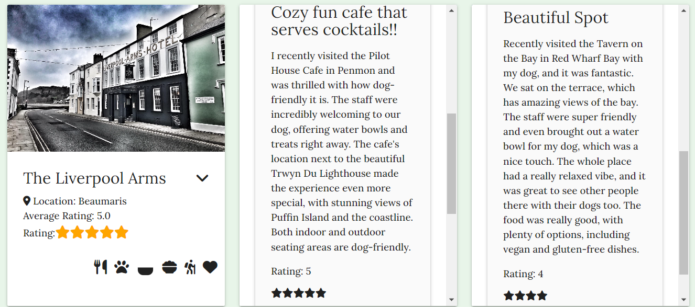

# Paws & Pints Testing

[Back to README.md](README.md)

[View the live project here.](https://paws-and-pints-9f68e52a491c.herokuapp.com/get_pubs)

Manual testing was performed continuously during development to ensure the functionality of various site features.

- - -

## CONTENTS

* [AUTOMATED TESTING](#automated-testing)
  * [W3C Validator](#w3c-validator)
  * [JavaScript Validator](#javascript-validation)
  * [Python Validator](#python-validation)
  * [Lighthouse](#lighthouse)
  * [WAVE Testing](#wave-testing)
* [MANUAL TESTING](#manual-testing)
  * [Testing User Stories](#testing-user-stories)
  * [Full Testing](#full-testing)
    * [Site Wide](#site-wide)
    * [Index Home](#index-home)
    * [Register Page](#register-page)
    * [Log In Page](#log-in-page)
    * [Profile](#profile)
    * [Add Pub](#edit-profile)
    * [Manage Reviewss](#manage-reviews)
    * [404 Page](#404-page)
  * [Accessibility Testing](#accessibility-testing)
* [BUGS](#bugs)
  * [Solved Bugs](#solved-bugs)
  * [Known Bugs](#known-bugs)

[*Back to top*](#contents)

-----

## AUTOMATED TESTING

### W3C Validator

The HTML on all pages of the site was validated using the W3C validator, and the CSS was also validated through the same tool. The HTML was checked by inputting the URL of the deployed site to avoid errors related to Jinja templating, while the CSS was validated via direct input.

Index HTML

Register HTML

Log In HTML

Profile HTML

Add Pub HTML

Manage Reviews HTML

CSS

>Note:
> The 404 page was manually tested by inputting the code directly into the validator and no errors were found except for those related to the Jinja templating.
>

Code input for 404 here.

>
>

[*Back to top*](#contents)

-----

### Javascript Validation

[JS Hint](https://jshint.com) The JavaScript on the site was tested and no major errors were found. However, some warnings for undefined and an unused variable were flagged. The undefined variable warnings stem from code copied from Materialize, and all variables are used within HTML files.

Vanilla Javascript

[*Back to top*](#contents)

-----

### Python Validation

[CI Python Linter](https://pep8ci.herokuapp.com) has been utilized to validate Python code on the site, ensuring it complies with PEP 8 standards. Initially, this highlighted numerous whitespace errors, but these have been resolved, and the current code is now PEP 8 compliant.

Python

[*Back to top*](#contents)

-----

### Lighthouse

The Lighthouse tool in Chrome Developer Tools has been used to test performance, best practices, accessibility, and SEO. Both desktop and mobile tests have been conducted for each page.

Index

| | Performance | Accessibility | Best Practice | SEO |
| :---: | :---: | :---: | :---: | :---: |
| Desktop | 99 | 100 | 100 | 100 |
| Mobile | 90 | 100 | 100 | 100 |

Register

| | Performance | Accessibility | Best Practice | SEO |
| :---: | :---: | :---: | :---: | :---: |
| Desktop | 100 | 100 | 100| 100 |
| Mobile | 99 | 100 | 100 | 100 |

Log In

| | Performance | Accessibility | Best Practice | SEO |
| :---: | :---: | :---: | :---: | :---: |
| Desktop | 100 | 100 | 100 | 100 |
| Mobile | 98 | 100 | 100 | 100 |

Profile

| | Performance | Accessibility | Best Practice | SEO |
| :---: | :---: | :---: | :---: | :---: |
| Desktop | 100| 100 | 100 | 100 |
| Mobile | 98 | 100 | 100 | 100 |

Add Pub

| | Performance | Accessibility | Best Practice | SEO |
| :---: | :---: | :---: | :---: | :---: |
| Desktop | 100 | 100 | 100 | 100 |
| Mobile | 98 | 100 | 100 | 100 |

Manage Reviews

| | Performance | Accessibility | Best Practice | SEO |
| :---: | :---: | :---: | :---: | :---: |
| Desktop | 99 | 95 | 100 | 100 |
| Mobile | 91 | 95 | 100 | 100 |

> Notes for Lighthouse Testing:

>* The accessibility score is lower on the admin's Manage Reviews page due to the delete button. This button uses Materialize classes, and despite efforts, it has not been possible to adjust the red background and white text enough to provide sufficient contrast.
>
>* Performance scores on mobile devices can be improved by reducing image sizes. This can be achieved by adding a function to the photo upload Flask route that automatically resizes images upon upload.

[*Back to top*](#contents)

-----

### WAVE Testing

Testing with [WAVE](https://wave.webaim.org) has identified issues with the img alt tags, indicating they are duplicate and potentially insufficient. To improve accessibility, users should be able to provide their own descriptive alt text. The default "user uploaded image" is not adequate.

[*Back to top*](#contents)

-----

## Manual Testing

### Testing User Stories

>#### User Goals
>
>- Discover dog-friendly pubs across Anglesey and explore their amenities and services.
>- Engage with authentic reviews from fellow users to make informed decisions about pub visits.
>- Contribute to the community by adding new dog-friendly pubs and sharing personal experiences through reviews.
>- THe ability to edit their review entries to reflect updated experiences or feedback.
>- The ability to add pubs to the site and uploaded a photo to accompany the pub details. 
>- The ability for the user to delete pubs and reviews that they themselves have added.
>

>#### Site Admin Goals
>
>In addition to user goals:
>
>-  Manage pub entries and reviews seamlessly with options to edit or delete content effortlessly
>- Create an immersive and user-friendly platform with intuitive navigation, captivating visuals, and an appealing design.
>-  Ensure a seamless user experience across all devices by implementing full responsiveness, allowing the website to adapt seamlessly to different screen sizes and device types.
>- The user to be directed to a custom 404 error page upon entering a non-existent URL.

| Goal | Implementation | Image |
| :---: | :---: | :---: |
|  Discover dog-friendly pubs across Anglesey and explore their amenities and services.| Pubs are showcased in cards that reveal descriptions and reviews upon clicking. Icons highlight pub amenities, and tooltips provide detailed descriptions when hovered over |  |
| Engage with authentic reviews from fellow users to make informed decisions about pub visits. | Reviews are displayed when clicking on a pub, with a star system visually representing the pub's rating. Additionally, each pub's location includes an average rating, also depicted with star |  |
| Contribute to the community by adding new dog-friendly pubs and sharing personal experiences through reviews. | Users can add their own review of any of the pubs listed|  |
| THe ability to edit their review entries to reflect updated experiences or feedback. |Users can edit their reviews directly from their profile page. |  |
| The ability to add pubs to the site and uploaded a photo to accompany the pub details.  | Logged-in users can add a pub through the 'Add Pub' tab.|   |
| The ability for the user to delete pubs and reviews that they themselves have added. | Logged in users can delete their reviews and pubs from the 'Profile' tab. |  |
| Manage pub entries and reviews seamlessly with options to edit or delete content effortlessly | Admin can edit or delete any post from the 'Manage Reviews' tab. |  |
|  Create an immersive and user-friendly platform with intuitive navigation, captivating visuals, and an appealing design. | The site offers a simple, straightforward design that ensures ease of use, while the photo upload feature enhances its visual appeal.|  | Ensure a seamless user experience across all devices by implementing full responsiveness, allowing the website to adapt seamlessly to different screen sizes and device types. | The site offers full responsive design. |  | The user to be directed to a custom 404 error page upon entering a non-existent URL.| The 404 error page features a 'Home' button that directs users back to the main page when clicked | 

[*Back to top*](#contents)

-----

### Full Testing

Full testing was performed on the following devices:

* Laptop
  * Lenovo IDEAPAD 

* Mobile
  * iphone 12
 
 Desktop device tested the site using the following browsers:
 
 * Google Chrome
 * Mozilla Firefox
 * Microsoft Edge
 * Safari 

#### Site-Wide

| Feature | Expected Outcome | Testing Performed | Result | Pass/Fail |
| --- | --- | --- | --- | --- |
| Navbar Links | Display different navigation bar links based on whether the user is logged out, logged in, or an admin. | View the site based on different login statuses. | Links are displayed according to each status | __PASS__ |
| Brand Logo | Directs user back to the home page | Clicked logo | Taken back to the home page | __PASS__ |

#### Index Home

| Feature | Expected Outcome | Testing Performed | Result | Pass/Fail |
| --- | --- | --- | --- | --- |
| Search Bar operational| Returns relevant search results | Entered text | Shown correct search resuts | __PASS__ |
| Write a review link actionable (logged in) | User to be directed to 'Write a review' page | Clicked link | Taken to write review, review submitted succesfully | __PASS__ |
| Write a review link actionable (logged out) | User to be directed to 'Login' page | Clicked link | Redirected to the login page | __PASS__ |
| Register nav link actionable  | Returns sign up form | clicked link |Taken to Sign up page | __PASS__ |
| Login nav link actionable  | Returns login form | clicked link |Taken to Login page | __PASS__ |

#### Register Page

| Feature | Expected Outcome | Testing Performed | Result | Pass/Fail |
| --- | --- | --- | --- | --- |
| Login link actionable | Redirects already registered users to the login page | Clicked link | Taken to login page | __PASS__ |
| Form validation | Error message appears to let user know they have not matched the required format | Input incorrect format | Helper text turns red and error message appears | __PASS__ |
| Username already taken  | Flash message if username is already in use | Attempt to sign up with the same username | Flash message appears | __PASS__ |
| View password Text | Password text revealed when user toggles 'show password' box | Clicks box | Password text becomes visible | __PASS__ |
| Register account | Flash message indicating registrationsuccess and user redirected to their profile | Register new account | Flash message appears and user redirected to profile | __PASS__ |

#### Log In Page

| Feature | Expected Outcome | Testing Performed | Result | Pass/Fail |
| --- | --- | --- | --- | --- |
| View password Text | Password text revealed when user toggles 'show password' box | Clicks box | Password text becomes visible | __PASS__ |
| Flash Message: Incorrect Username or Password | Test with incorrect username and password | Flash message appears | PASS |
Log in | Flash message indicates success and redirects to profile | Enter correct login credentials | Flash message appears and redirects to profile __PASS__ |

#### Profile

| Feature | Expected Outcome | Testing Performed | Result | Pass/Fail |
| --- | --- | --- | --- | --- |

| User Profile Accessible Only to the Logged-In User | Redirects Unauthorized Access to Login Page | Enter Incorrect Username in URL | Redirects User to Login Page | PASS |
| User Review Edit Button Functional on Profile page| Displays the user's full review with options to edit or cancel | Click the edit button | Full review details are shown |
| Edit Button on Review Page Functional | Allows input of revised details and provides a flash message | Click the edit button | Details are updated and a flash message is displayed |
| Cancel Edit Review Button Functional | Redirects User to Profile | Click Cancel Button | User Redirected to Profile | PASS |
| Delete Review Button Functional | Redirects to Confirm Deletion Page | Click Delete Button | Displays Confirm Deletion Page | PASS |
| Cancel Delete Review Button Functional | Cancels Deletion and Redirects to Profile Page | Click Cancel Button | Deletion Canceled and Redirected to Profile Page | PASS |
| Edit Pub Details Button Operational | Shows Pub form pre-filled with the user's previous input | Click the Edit button to modify pub information | Updates pub details, displays a flash message, and user directed to upload photo page | PASS |
| Edit Pub Details Button Operational | Shows Pub form pre-filled with the user's previous input | Click the Edit button to modify pub information | Updates pub details, displays a flash message, and user directed to upload photo page | PASS |
| Upload new photo button functional | Updates image and redirects user to their profile page | Click button and upload new image | Updates pub image, displays flash message and redirects to profile page | PASS |
| Continue without uploading image button | Directs user back to their profile page | Click button | User redirected to profile page | PASS |

#### Add Pub

| Feature | Expected Outcome | Testing Performed | Result | Pass/Fail |
| --- | --- | --- | --- | --- |

| Submission blocked if inputs are left empty | Submission of partially completed forms blocked with an error message instructing the user to complete the required fields | Enter information in some but not all fields | An error message appears, and submission prevented | PASS |
| Submit button functional | Displays upload photo page | Click button | Upload photo page correctly displayed | __PASS__ |
| Upload button functional | Returns user to their profile and flash message appears  | uploads photo | Flash message appears and user redirected to profile | __PASS__ |
| Continue without uploading button functional | Returns user to their profile page | Clicks button | User redirected to profile page  | __PASS__ |

#### Manage Reviews

| Feature | Expected Outcome | Testing Performed | Result | Pass/Fail |
| --- | --- | --- | --- | --- |
| User must be logged in to access this page | Redirects to the login page if not authenticated | Access via direct URL entry | Redirects to login page | PASS |
| Delete Review Button Functional | Redirects to Confirm Deletion Page | Click Delete Button | Displays Confirm Deletion Page | PASS |
| Confirm Delete Review Button Functional | Review deleted, flash message displayed and user redirected to manage reviews page | Click confirm deletion Button | 'Review sucessfully deleted' message displayed, user returned to manage reviews page.| PASS |
| Cancel Delete Review Button Functional | Cancels Deletion, user returned to manage reviews page | Click Cancel Button | Deletion Canceled and Redirected to Manage Reviews Page | PASS |
| Delete Pub Button Operational | Redirects to confirm deletion page | Click button | Confirm deletion page displayed. | PASS |
| Confirm Delete Pub Button Functional | Pub deleted, flash message displayed and user redirected to manage reviews page | Click confirm deletion Button | 'Pub sucessfully deleted' message displayed, user returned to manage reviews page.| PASS |
 |

-----

## Bugs

### Solved Bugs

| Bug                                                                                                                                         | Fix                                                                                    |
| ------------------------------------------------------------------------------------------------------------------------------------------- | -------------------------------------------------------------------------------------- |
| Initial rendering of reviews.html failed with a cursor object error.  | The problem arose from using 'reviews.pub_name' to access database information. However, 'reviews' represents the entire cursor object retrieved from MongoDB, while 'pub_name' is an attribute of each individual document (review) within the cursor. Changing 'reviews' to 'review' in the iteration loop resolved the error.   | 

 Side navbar mobile function not working, 404 error on js file being returned  | A simple typo had caused this error, the Javascript folder had been named 'jss'. Correcting it to 'js', resolved the issue and the scripts.js file was able to be located and executed    | 

Encountered a type error while attempting to implement a visual star rating system based on the users rating.   | The issue stemmed from comparing a string to an integer, resulting in a TypeError. Resolution involved converting the rating to an integer using the int() function before comparison, thereby rectifying the issue."   | 

Resolved an issue where the food bowl icon failed to display in the review card main panel.  | The problem stemmed from a typo in the MongoDB naming pairs, where 'dog_meals=True' was incorrectly written as 'dog_meals=:True'. By removing the erroneous '=', the fontawesome food bowl icon now displays correctly.  | 

After implementing a for loop in the get_pubs application to fetch and render reviews associated with pub IDs, only pubs were displayed on the homepage without any reviews |   To address this, debugging statements were integrated into the route function, revealing that although both pubs and reviews were retrieved from the database, there were no reviews associated with pub IDs. A thorough examination of the MongoDB collections highlighted a data type discrepancy: the reviews collection utilized "pub_id" as a string, while the pubs collection employed ObjectId. This mismatch prevented proper association between pubs and reviews.

Resolution: To resolve the issue, code was added to convert ObjectId to a string format when retrieving data from the pubs collection. This adjustment ensured compatibility between the pub IDs in both collections, enabling accurate linkage between pubs and their associated reviews. With the data type mismatch rectified, the reviews were successfully associated with the corresponding pubs, allowing them to be displayed on the homepage as intended.   | 

Issue around displaying user_rating within the reviews visually as stars, despite converting to integers within the write_review route there was still a type error being displayed.  |  It appears that the issue is not with the conversion of user_rating to an integer in the route function but rather with how it's being used in the template. The error message indicated that a string object cannot be interpreted as an integer, which suggests that user_rating is still a string when it's being used in the template. Further investigation revealed that the error specifically occured on the line where user_rating was being used in the range function.
This was resolved by adding |int after review.user_rating, which ensured that user_rating was intepreted as an integer before being used in the range function.   | 

After creating the Flask route for editing reviews, an issue arose where the edit_review.html template failed to render. No error messages were displayed, and upon introducing print statements to the route for debugging, it became apparent that the route wasn't being called at all.Further investigation revealed a simple error in the edit_review.html template. The "Edit" button was not enclosed within a form element, preventing the GET request to the edit_review URL from being sent.   | Correcting this oversight by ensuring the "Edit" button was appropriately placed within a form element with the method set to "GET" enabled the Flask route to handle the GET request effectively, resulting in the expected rendering of the edit_review.html template

[*Back to top*](#contents)

-----

### Known Bugs

[*Back to top*](#contents)

-----